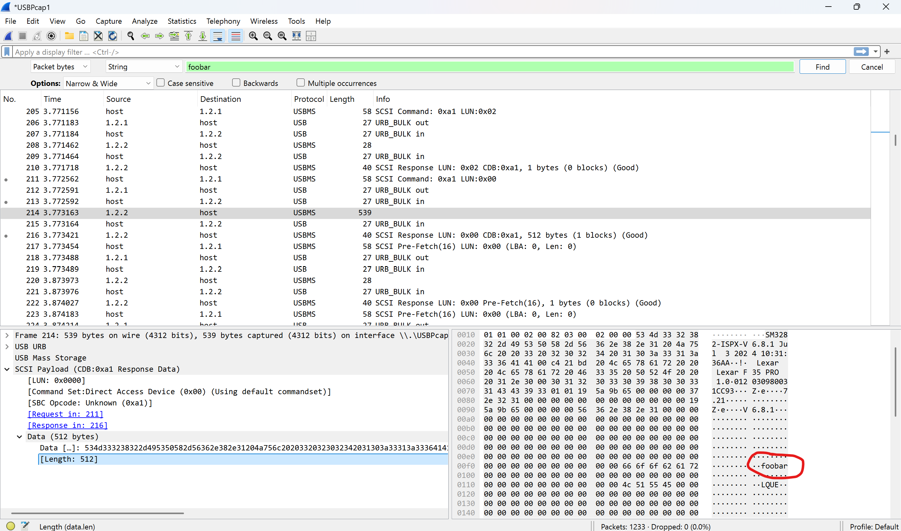

# Cleartext password disclosure in Lexar F35 Pro fingerprint encrypted USB flash drives

- **CVE ID:** CVE-PENDING *(requested; will be updated when assigned)*
- **Vendor:** Lexar
- **Product:** F35 Pro fingerprint encrypted USB flash drive
- **Affected firmware:** versions shipped prior to the vendor's September 2025 firmware update
- **Companion software:** `FingerTool_lexar(Windows).exe` version 1.0.36.0
- **CWE:** [CWE-319: Cleartext Transmission of Sensitive Information](https://cwe.mitre.org/data/definitions/319.html)
- **CVSS v3.1:** 6.1 (Medium) — `AV:P/AC:L/PR:N/UI:N/S:U/C:H/I:H/A:N`
- **Reporter:** Xusheng Li (independent research, not on behalf of any employer)
- **Status:** Fixed by the vendor on at least one unit confirmed by the reporter on 2025-10-19; broader availability of the updated firmware is not confirmed.

## Summary

The Lexar F35 Pro is a USB flash drive marketed as offering hardware-encrypted storage that is unlocked either by a registered fingerprint or by a password configured through the vendor's Windows companion utility, `FingerTool_lexar(Windows).exe`.

In the affected firmware, the drive returns the user-configured unlock password to the host in cleartext as soon as the companion utility is launched, *without* the user being prompted to enter or confirm the password. This is not the (much milder) case of a password being observable on the USB bus when the legitimate owner types it in to authenticate — there, an attacker would still need to be present and capturing during a real login session. Here, no login is involved at all: anyone in physical possession of the drive can plug it into a Windows computer, launch the official utility, and read the stored password from the USB traffic. The recovered password can then be used to unlock the drive and access its protected contents — fully defeating the at-rest confidentiality property the device is sold to provide.

## Affected product

- Lexar F35 Pro Fingerprint Encrypted USB Flash Drive, with firmware as shipped on 2025-08-17 (the date of initial report) and the bundled companion utility `FingerTool_lexar(Windows).exe` version 1.0.36.0.
- Vendor product pages:
  - <https://www.lexar.com/global/products/Lexar-JumpDrive-Fingerprint-F35-PRO-USB-3-2-Gen-1-Flash-Drive/>
  - <https://americas.lexar.com/product/lexar-jumpdrive-fingerprint-f35-pro-flash-drive/>

## Technical details

When `FingerTool_lexar(Windows).exe` (version 1.0.36.0 was tested) communicates with an attached F35 Pro, the drive transmits the user-configured password to the host in cleartext over the USB bus. The exchange takes place as soon as the utility is launched and the drive is attached. The user is *not* prompted to type or re-enter the password; the drive returns the stored value on its own in response to the utility's queries. In other words, the password leak is not gated on someone authenticating — it would be a far less serious issue if the password were merely observable while the legitimate user was typing it during a real unlock, because that would require the attacker to be capturing USB traffic at the moment the owner authenticates. Here the drive volunteers the password to any host that runs the bundled tool.

The screenshot below shows a Wireshark capture of one such exchange. The test password `foobar` (set up earlier by the reporter) appears verbatim in the USB traffic — no obfuscation, no hashing, no challenge/response, and no session encryption is in use:

Because the disclosure happens during normal interaction with the bundled utility, it does not depend on observing a legitimate user authenticate. Any host with physical access to the drive can elicit the response on its own simply by running the software that ships with the drive.

## Proof of concept

1. Configure an F35 Pro with a password and a fingerprint via `FingerTool_lexar(Windows).exe`. For the test, the password `foobar` was used.
2. Detach the drive and re-attach it.
3. Begin a USB capture (e.g., Wireshark with USBPcap on Windows) on the interface the drive is enumerated on.
4. Launch `FingerTool_lexar(Windows).exe`.
5. Inspect the captured traffic. The cleartext password configured in step 1 appears in the USB data returned by the drive (see screenshot).
6. The recovered password can subsequently be used through `FingerTool_lexar` to unlock the drive and read its protected contents.

## Impact

The F35 Pro is sold as a hardware-encrypted drive whose stored data is protected by the configured fingerprint and password. The vulnerability means that anyone who gains physical possession of the drive — for example by finding or stealing it — can recover the password by plugging the drive into a Windows machine, running the vendor's own utility, and observing the USB traffic. The recovered password then grants full read/write access to the protected storage, breaking the device's core confidentiality and integrity guarantee.

The vendor noted during triage that the cleartext exchange occurs in the code path exercised when `FingerTool_lexar` is opened, and is not exercised on the daily fingerprint-only unlock path. The vulnerable code path is nonetheless reachable by an attacker at will: holding the drive and launching the utility is sufficient to trigger it.

## Mitigation

Lexar developed a firmware update in response to this report and provided the reporter with an F35 Pro on which the issue was already fixed. The reporter confirmed on 2025-10-19 that the cleartext disclosure no longer occurs on that unit. The firmware version of the updated unit was not recorded, and it is not known whether the fixed firmware has been rolled out to units sold through retail channels. Owners of F35 Pro drives concerned about this issue should contact Lexar support to ask about the availability of updated firmware.

## Disclosure timeline

All dates are UTC.

| Date | Event |
|---|---|
| 2025-08-17 | Reporter sends vulnerability report and proof of concept to `support@lexar.com`. Lexar acknowledges receipt (ticket 19474). |
| 2025-08-18 | Lexar escalates the report to its technical team. |
| 2025-09-15 | Lexar confirms the issue and reports that a firmware update addressing the bug has been developed. |
| 2025-10-19 | Reporter confirms the fix resolves the cleartext disclosure on the unit provided. |
| TBD | CVE ID requested; this advisory will be updated when the ID is assigned. |

## Distinct from CVE-2021-46390

A prior advisory, [CVE-2021-46390](https://nvd.nist.gov/vuln/detail/CVE-2021-46390) / [GHSA-fcqg-mq6w-h3fh](https://github.com/bosslabdcu/Vulnerability-Reporting/security/advisories/GHSA-fcqg-mq6w-h3fh), describes a different weakness in the same Lexar F35 Pro product line and is easy to confuse with the issue reported here. The two are distinct:

- **CVE-2021-46390** requires the attacker to attach a debugger to the companion utility and override the result of the authentication check inside the process, granting access without ever learning the password.
- **This advisory** requires no debugger, no code patching, and no manipulation of the utility at runtime. The drive itself returns the user-configured password to the host in cleartext as soon as the bundled utility is launched, and the attacker simply reads it off the USB bus.

## Related work

This advisory is adjacent to, but not covered by, the reporter's re//verse talk *Breaking Encrypted USB Drives with Time-Travel Debugging* (<https://www.youtube.com/watch?v=Rv6jdnQ4YhY>), which examines other encrypted USB drives using time-travel debugging. The Lexar F35 Pro issue described here is a separate finding from the same broader line of research.

## Credit

Discovered and reported by Xusheng Li. This research was conducted in a personal capacity and does not represent the views of the reporter's employer.
