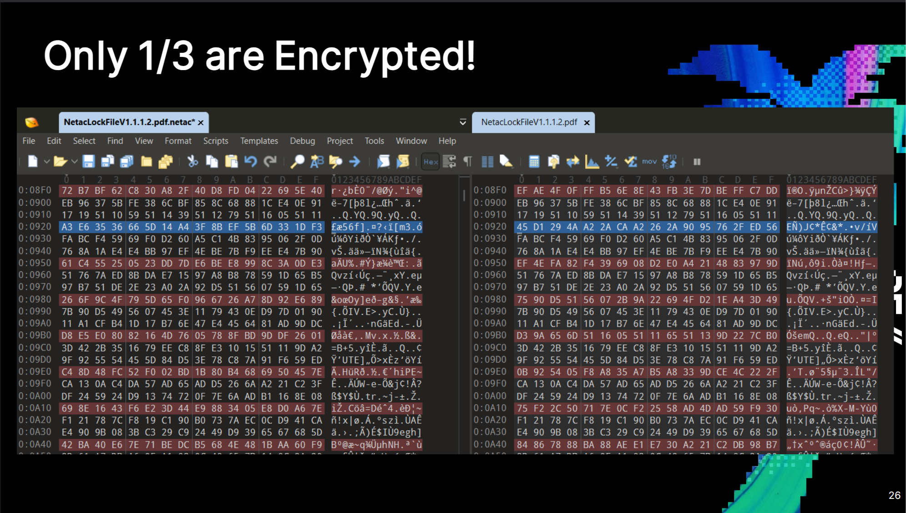

# Incomplete file encryption (only ~1/3 of file encrypted) in Netac NetacLockFile

- **CVE ID:** CVE-PENDING *(requested; will be updated when assigned)*
- **Vendor:** Netac Technology Co., Ltd.
- **Product:** NetacLockFile file-encryption utility (`NetacLockFile.exe` v1.1.1.2), bundled with Netac encrypted USB flash drives
- **CWE:** [CWE-311: Missing Encryption of Sensitive Data](https://cwe.mitre.org/data/definitions/311.html)
- **CVSS v3.1:** 5.4 (Medium) — `AV:L/AC:L/PR:N/UI:N/S:U/C:H/I:N/A:N`
- **Reporter:** Xusheng Li (independent research, not on behalf of any employer)
- **Status:** Reported to Netac on 2025-10-19; no vendor response and no fix as of publication.

## Summary

NetacLockFile is a file-encryption utility shipped with Netac encrypted USB drives. It is marketed as encrypting files under a user-chosen password.

In version 1.1.1.2, only about **one third** of each file is actually encrypted; the other two thirds are written to the output container in cleartext. The majority of the original content can therefore be read straight out of the "encrypted" file — no key, password, or cryptography required.

## Technical details

Comparing a container against its original input shows that only about one block in three is transformed by the cipher; the rest is copied through byte-for-byte. The cleartext is interleaved throughout the file (not confined to a header or trailer), so large spans of the original plaintext sit in the container unprotected.

The screenshot below, from the reporter's RE//verse 2026 talk, shows an input file (right) beside its NetacLockFile container (left): two of every three regions are identical, and only the third is scrambled.

(The encrypted third is itself broken by a separate defect — a fixed, password-independent AES key; see [hardcoded-key.md](hardcoded-key.md).)

## Proof of concept

1. Create an input file with recognizable, evenly distributed content (e.g. many sequentially numbered lines).
2. Encrypt it with NetacLockFile under any password.
3. Open the container in a hex editor or run `strings` over it.
4. Roughly two thirds of the original content appears unchanged, readable with no key or password.

## Impact

The tool exists to keep file contents confidential when the container is exposed — on a lost or stolen drive, in a backup, or in transit. Because most of each file is never encrypted, anyone who obtains the container recovers the bulk of the plaintext immediately. This holds regardless of password strength or key secrecy: data that is never encrypted cannot be protected by either.

## Mitigation

No vendor fix is available. Treat files "encrypted" with the affected version as unprotected, and use a vetted file- or volume-encryption tool instead until NetacLockFile encrypts the entire file.

## Disclosure timeline

All dates are UTC.

| Date | Event |
|---|---|
| 2025-10-19 | Reporter sends report and proof of concept to Netac. |
| 2025-10-19 → | No acknowledgement, response, or patch from the vendor. |
| 2026-03-05 → 2026-03-07 | Publicly disclosed in the reporter's talk at RE//verse 2026 (Orlando, FL), after the 90-day window. |
| TBD | CVE ID requested; advisory will be updated when assigned. |

## Related work

Presented in the reporter's talk *Breaking Encrypted USB Drives* at [RE//verse 2026](https://re-verse.io/) (March 5–7, 2026, Orlando, FL). Recording: <https://www.youtube.com/watch?v=Rv6jdnQ4YhY>.

## Credit

Discovered and reported by Xusheng Li, in a personal capacity; this does not represent the views of the reporter's employer.
